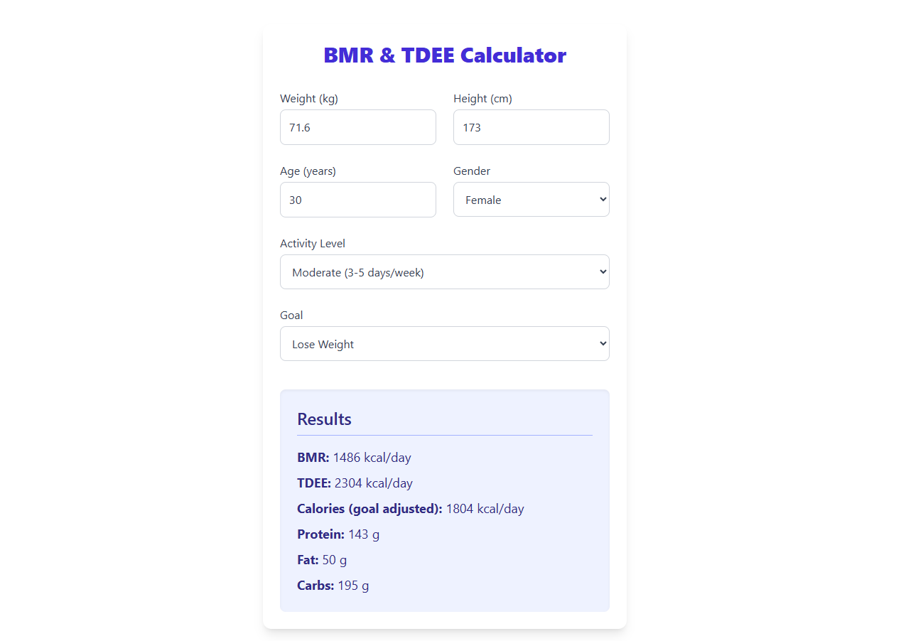

# BMR & TDEE Calculator

A simple and intuitive React app that calculates your Basal Metabolic Rate (BMR) and Total Daily Energy Expenditure (TDEE), plus personalized macronutrient targets based on your weight, height, age, gender, activity level, and fitness goal.

---

## Features

- Calculates BMR using the Mifflin-St Jeor Equation  
- Calculates TDEE by factoring in your activity level  
- Adjusts calorie recommendations based on your goal: lose, maintain, or gain weight  
- Breaks down daily macronutrients (protein, fat, carbs) with sensible defaults  
- Clean, responsive UI styled with Tailwind CSS  

---

## Demo

  
*(Add a screenshot here to showcase your app)*

---

## Installation

1. Clone the repo  
   ```bash
   git clone https://github.com/MedAmineCk/bmr-tdee-calculator.git
   cd bmr-tdee-calculator
2. Install dependencies  
   ```bash
   npm install
    ```
3. Run the app  
   ```bash
   npm run dev
   ```
